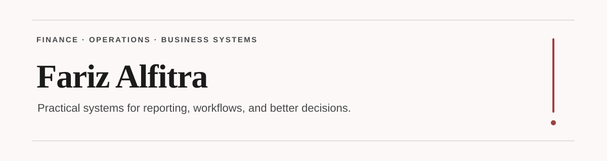

  

Work spans finance, operations, reporting, and business systems, with a focus on improving visibility, reducing manual work, and supporting better decisions.

Background includes data analytics, financial analysis, FP&A, and organizational operations. Current work applies that experience across education foundations while building products and operational systems through Projecttt.

## Featured Work

### Financial Reporting Transformation [↗](https://alfitraaa.github.io/case-studies/financial-reporting-transformation.html)
Reconstructed and standardized historical financial records to create a more reliable reporting and reconciliation workflow.

### Finance Operations Reporting System [↗](https://alfitraaa.github.io/case-studies/financial-operations-reporting-system.html)
Designed a structured finance operations system to improve reporting consistency, transaction visibility, and management review.

### Project Governance & Construction Oversight [↗](https://alfitraaa.github.io/case-studies/project-governance-construction-oversight.html)
Built a clearer management approach for tracking project costs, vendors, payment stages, progress, and unresolved issues.

## Current Builds

### Projecttt [↗](https://github.com/projectttco)
Independent product and systems studio focused on practical tools built around real operational problems.

### Pablo
Private execution workspace for coordinating complex projects, recurring work, and operational follow-up.

### Commerce Operations
Systems for product management, order workflows, operational tracking, and commerce automation.

## Selected Repositories

### Super Cashier [↗](https://github.com/alfitraaa/Super_Cashier)
Python project covering transaction handling, business rules, validation, and automated regression testing.

### Supply Chain Analytics [↗](https://github.com/alfitraaa/Supply_Analytics)
Supply chain analysis using Python and Power BI, covering shipment delays, inventory analysis, and data quality investigation.

### Cohort Retention Analysis [↗](https://github.com/alfitraaa/Cohort_Analysis_Excel)
Excel-based cohort analysis covering customer retention, PivotTables, formulas, and business interpretation.

## Tools I Use

Excel • Google Sheets • Power BI • Python • SQL • n8n • Supabase • Git

## Links

[Portfolio](https://alfitraaa.github.io/) • [Projecttt](https://github.com/projectttco) • [LinkedIn](https://www.linkedin.com/in/farizalfitra/)
